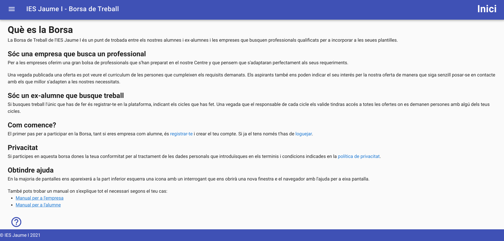

# Borsa de Treball del CIP FP Batoi
Aquesta és l'ajuda de la borsa de treball del CIP FP Bati. Es tracte d'un punt de trobada entre les empreses que busquen professionals per a incorporar a la seua plantilla i els alumnes i antics alumnes que s'han format en el Centre.

## Soc una empresa
Si ets una empresa pots publicar ofertes de treball que els antics alumnes registrats en la borsa veuran inmediatament i podran inscriurer-se a elles. Quan publiques una oferta has d'indicar els estudis que han de tindre els aspirants (pots posar 1 o més cicles) i tots els usuaris que tinguen el títol (o un d'ells si has indicat més d'un) que has sol·licitat rebran un e-mail amb les dades de la oferta. Si estan interessats en la mateixa ho indiquen i tú pots veure en tot moment els alumnes interessats en ella per a que pugues contactar amb ells. Podras veure un enllaç al C.V. de l'alumne si el tenen en alguna plataforma com Lnkedin així com el seu e-mail i telèfon per a poder contactar en ells que te interessen.

La primera vegada que vulgues utilitzar aquesta borsa t'has de registrar indicant un nom d'usuari, un email i una contrasenya. Una vegada registrat hauràs d'introduir la informació de la teua empresa (nom, adreça, persona de contacte, etc) i ja pots començar a treballar amb la borsa i ha publicar ofertes.

## Soc un antic alumne
Si has estudiat algun cicle formatiu en el CIP FP Batoi es pots apuntar a la borsa per a rebre ofertes de treball que demanen algun dels cicles que has estudiat. La primera vegada que vulgues utilitzar aquesta borsa t'has de registrar indicant un nom d'usuari, un email i una contrasenya. Una vegada registrat hauràs d'introduir la teua informació de contacte (nom, adreça, telèfon, email, etc) i els cicles que has estudiat en Batoi. És molt recomanable introduir també la pàgina web on tingues el teu C.V. (com Linkedin o similar) per a que les empreses que publiquen una oferta el puguen veure. També has de indicar si vols partcipar en la borsa de treball i/o si vols rebre informació del Centre. Una vegada fet ja pots començar a treballar amb la borsa i ha publicar ofertes.

Una vegada el responsable del teu cicle verifique que realment has finalitzat els cicles que has indicat rebras un email cada vegada que es publique una oferta que demane un dels teus cicles. A més pots loguejar-te i veure totes les ofertes disponibles per a tú.

