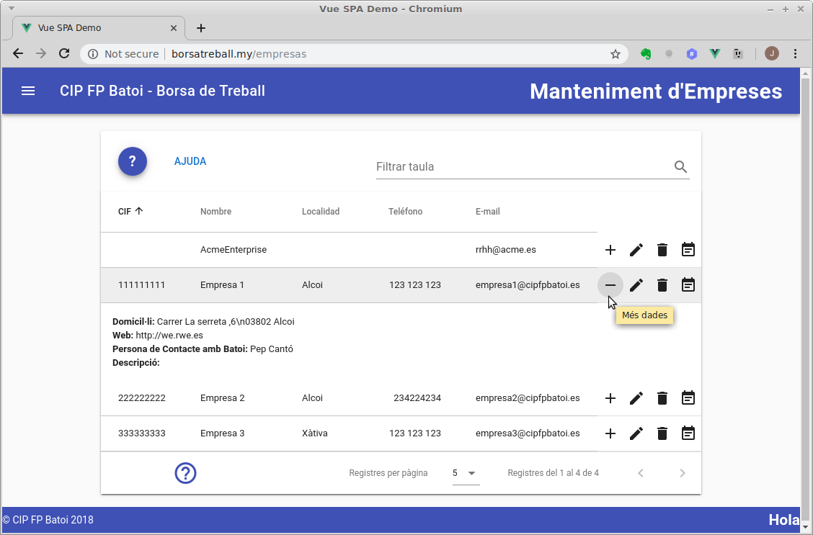

# Manteniment d'Empreses
Aquesta pàgina només és accesible per als responsables de la borsa. Una empresa ací només pot veure les seues dades. La informació que trobem és:

- **CIF**: Cif de l'empresa
- **Nom**: Nom de l'empresa
- **Localitat**, **Telèfon** i **E-mail** de l'empresa
- **Accions**: Ací tenim icones per a:
    - **Més dades**: apareix a més el domicil·li, la pàgina web, la persoa de contacte i una descripció de l'empresa
    - **[Editar](#editar-una-empresa)**: ens permet modificar les dades de l'empresa
    - **Esborrar**: esborra l'empresa. Això vol dir que s'esborrarà l'empresa i totes les seues dades i ofertes, així com l'usuari que ha creat per a iniciar sessió. Aquesta acció **NO POT DESFER-SE**.
    - **[Veure ofertes](./ofertes)**: es mostren totes les ofertes d'aquesta empresa

## Editar una empresa
Des d'ací podem modificar les dades de l'empresa:

Una vegada modificada, per a que es guarden els canvis hem de prèmer el botó de **GUARDAR**. Si volem descartar els canvis polsarem el botó de **CANCEL·LAR**. Per a obtindre ajuda pulsarem sobre la icona de l'interrogant.
