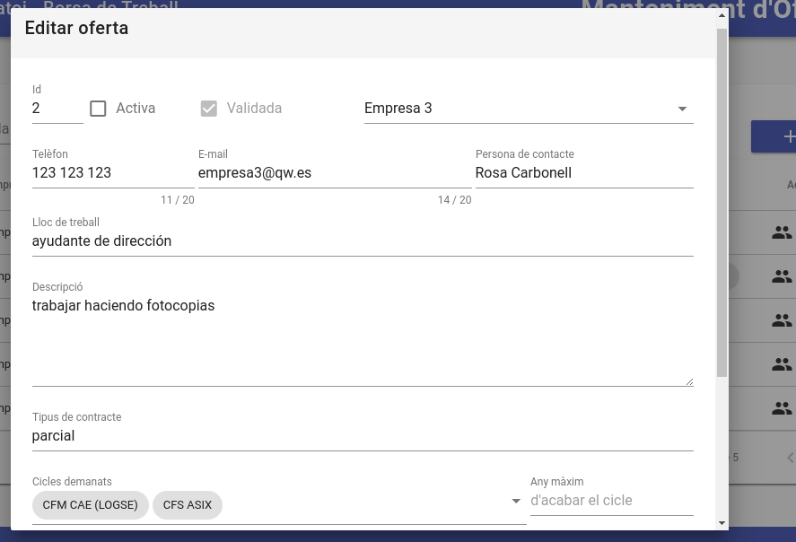

# Ofertes de treball
Ací les empreses podem gestionar les seues ofertes de treball. En el següent apartat s'indica [cóm crear una nova oferta de treball](#crear-una-nova-oferta).

Els responsables de la borsa poden veure les ofertes de totes les empreses. Respecte als alumnes, només tenen accés a les ofertes que demanen algú dels cicles que tenen i la informació que veuen és la que apareix en la pàgina de [ofertes per a l'alumne](./ofertasxalumno.md). 

La informació que trobem ací és:

- **Activa**: Indica si l'oferta està actualment **activa** (V) o no (X). La empresa és que pot desactivar una oferta. Si la desactiva la oferta deixarà d'aparèixer-li als alumnes. A més el color indica si aquesta oferta ha estat ja **validada** pel responsable de la borsa (color verd) o encara no (color roig). Només els apareixen als alumnes les ofertes actives i validades
- **Empresa**: Nom de l'empresa que publica aquesta oferta
- **Lloc de treball**: informació sobre el lloc de treball oferit
- **Tipus de contracte**
- **Cicles demanats**: Cicles que ha tindre un alumne per a poder optar a aquesta oferta. Es pot indicar més d'un cicle i en aquest cas la oferta li apareixerà als alumnes que tinguen qualsevol dels cicles demanats. Apareix el codi del cicle i al deixar el ratolí damunt d'ell apareix un missatge amb el nom sencer del cicle. El codi començarà per CFM si es un cicle formatiu de **grau mitjà** o per CFS si és de **grau superior**
- **Accions**: Ací tenim icones per a:
    - **Alumnes interessats**: apareix baix de l'oferta una llista d'alumnes que han vist aquesta oferta i han indicat el seu interés en la mateixa. Podem veure el nom de l'alumne (i si polsem en ell s'obrirà una nova finestra amb el seu curriculum en cas de que l'haja indicat), el seu e-mail i el seu telèfon.  a més el domicil·li, telèfon i e-mail de l'alumne
    - **[Editar](#editar-una-oferta)**: ens permet modificar les dades de l'oferta
    - **Esborrar**: esborra l'oferta. Això vol dir que s'esborraran totes les seues dades. Aquesta acció **NO POT DESFER-SE**.

## Crear una nova oferta
Per a crear una nova oferta pulsem en el botó d'afegir (+ blau) que trobem sobre la taula a la part dreta. La informació que hem d'omplir és:
- **Activa**: si està activa aquesta oferta. Només les ofertes actives i validades els apareixeran als alumnes. Quan vulguem publicar l'oferta marcarem la casella d'activa.
- **Validada**: aquesta casella només la pot marcar el responsable de la borsa una vegada revisada l'oferta. Només les ofertes actives i validades els apareixeran als alumnes
- **Empresa** que publica l'oferta. Ja apareix seleccionada la meua empresa
- **Telèfon**, **e-mail** i **persona de contacte**: les dades de contacte per a aquesta oferta. Per defecte apareixen les dades de la nostra empresa però les poden canviar. Aquesta informació la veuran els alumnes per a contactar amb nosaltres si marquem la casella de _'Mostrar contacte'_
- **Mostrar contacte**: si marquem aquesta casella els alumnes podran veure la informació anterior (telèfon, email i persona de contacte) junt a l'oferta. Si no, no veuran més que el nom de l'empresa i serà l'empresa la encarregada de posar-se en contacte amb ells. Per defecte està marcada
- **Lloc de treball**: informació del lloc de trebal oferit
- **Descripció**: una descripció mes llarga del treball oferit
- **Tipus de contracte**: informació sobre el contracte oferit (temps parcial, indefinit, ...)
- **Cicles demanats**: llista desplegable on seleccionem el cicle que ha de tindre un alumne per a poder veure aquesta oferta. Si seleccionem més d'un cicle la oferta els apareixerà a tots els alumnes que tinguen algun dels cicles seleccionats. Pots consultar la llista de [cicles formatius](../ciclos/lista.md) impartits al Centre.
- **Any màxim d'acabar el cicle**: aquest camp és opcional. Si posem un any l'oferta només es mostrarà als alumnes que hagen acabat els seus estudis amb posterioritat a l'any indicat. Si ho deixem en blanc se li mostrarà a tots els alumnes que tinguen el cicle.

Una vegada validada una oferta activa tots els alumnes de la borsa que complisquen els criteris indicats rebran un email amb aquesta oferta. Els que estiguen interessats ho indicaran i a partir d'eixe moment ens apareixeran en la taula ofertes al polsar sobre el botó d'**alumnes interessats**.

## Editar una oferta
Des d'ací podem modificar les dades de l'oferta:

Una vegada modificada, per a que es guarden els canvis hem de prèmer el botó de **GUARDAR**. Si volem descartar els canvis polsarem el botó de **CANCEL·LAR**. Per a obtindre ajuda pulsarem sobre la icona de l'interrogant.

Si volem canviar els cicles polsem sobre la línia de cicles demanats i es desplegarà una llista amb tots els cicles disponibles. Marquem la casella dels que vulgam i punxem fora de la llista amb el ratolí per a veure els cicles seleccionats:

